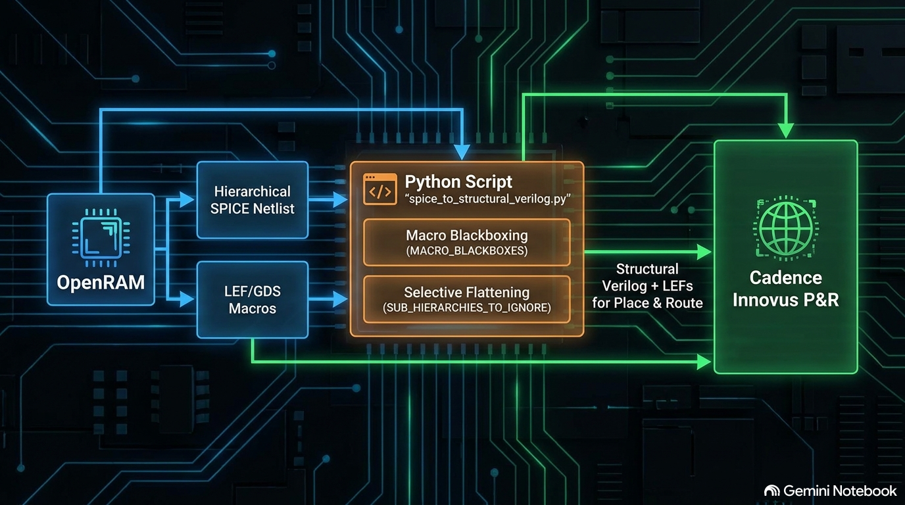
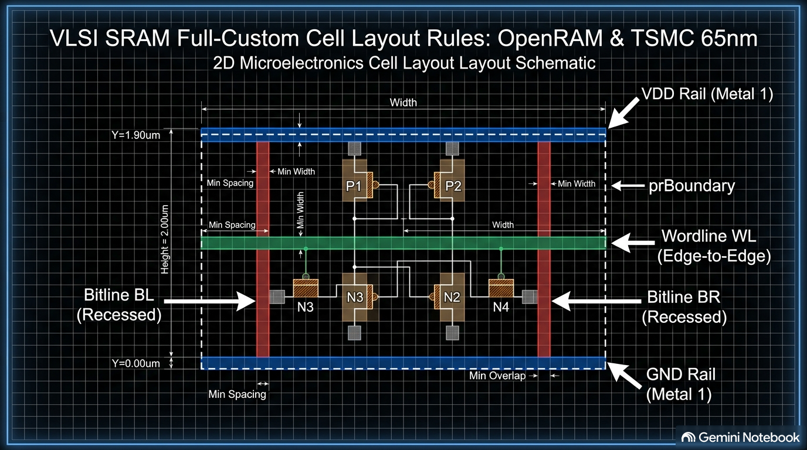

# 🛠️ Variáveis de ambiente:
`TECNOLOGIA=sua_tecnologia`  --> sua tecnologia será uma pasta dentro de caminho para o `$OPENRAM_HOME/../technology`
`OPENRAM_HOME=caminho para o OpenRAM/compiler`
`OPENRAM_TECH=$OPENRAM_HOME/../technology/$TECNOLOGIA`

## 🏁 0. Passo a Passo de Execução do Fluxo

Da pasta raíz do OpenRAM:

1. **Configuração do Ambiente**:

   ```bash
   export SUA_TECNOLOGIA=tsmc65N
   export OPENRAM_HOME=/home/$USER/OpenRAM/compiler
   export OPENRAM_TECH=/home/$USER/OpenRAM/technology/$SUA_TECNOLOGIA
   nix develop
   ```
2. **Geração da Memória e Macros no OpenRAM**:
   ```bash
   python3 sram_compiler.py config_tsmc65
   ```
   *Esta etapa gera a netlist SPICE global e exporta os arquivos `.lef` e `.gds` dos sub-blocos na pasta `output/`.*
3. **Conversão da Netlist SPICE para Verilog**:
   ```bash
   python3 technology/tsmc65N/spice_to_structural_verilog.py output/sram_16x16.sp
   ```
4. **Integração no Cadence Innovus**:
   * Importar a biblioteca de *standard cells* TSMC 65nm e os arquivos LEF gerados na pasta `output/`.
   * Importar o Verilog Estrutural gerado (`.v`) pelo script `spice_to_structural_verilog.py`
   * Executar o *Floorplan*, *Placement* dos macros e o Roteamento automático (*NanoRoute*) no Innovus. Utilize o TCL presente em `$OPENRAM_TECH`. Esse TCL está bastante automatizado mas podem ser necessários ajustes em espaçamentos de pinos, H/W do floorplan, etc. Ele está bastante comentado então é fácil fazer as customizações.


# 🛠️ Guia de Implementação SRAM Customizada (OpenRAM + TSMC 65nm)

Este guia documenta o fluxo de adaptação do gerador de memórias **OpenRAM** para a tecnologia **TSMC 65nm**, contornando limitações de roteamento e DRC do OpenRAM por meio da geração de **Verilog Estrutural** e roteamento no **Cadence Innovus**.

---

## 📌 1. Visão Geral do Fluxo

Durante a utilização do OpenRAM, identificou-se que o seu roteador interno gera diversos erros de DRC (espaçamento, vias e *edges*). Para solucionar isso, o fluxo foi adaptado para integrar o Cadence Innovus no *Place & Route* (P&R).



1. **OpenRAM**: Utilizado para gerar a netlist SPICE hierárquica e exportar os macros analógicos/matrizes em LEF/GDS.
2. **Script Python (`spice_to_structural_verilog.py`)**: Converte a netlist SPICE em Verilog Estrutural, aplicando achatamento (*flattening*) seletivo e gerando *blackboxes* para os macros.
3. **Cadence Innovus**: Recebe o Verilog Estrutural e os LEFs dos macros para realizar o *Place & Route* final de forma limpa.

---

## 📐 2. Requisitos de Células Full Custom no Virtuoso

Para que o OpenRAM monte a memória corretamente, as células base devem ser criadas via projeto *Full Custom* no Cadence Virtuoso:

* **Matriz de Células e Periferia Analógica**: `cell_1rw`, `replica_cell_1rw`, `dummy_cell_1rw`, `precharge`, `sense_amp`, `write_driver`.
* **Portas Lógicas Digitais (PDK)**: `inv` (INVD0), `nand2` (ND2D0), `and2` (AND2D0), `and3` (AN3D0), `dff` (DFQD1).

Observe os nomes dos gds em `OPENRAM_HOME/../technology/tsmc65N/gds_lib`. Mantenha esses nomes. O script `spice_to_structural_verilog.py`fará a troca dos nomes das standard cells do PDK para utilização no Innovus.

O PVS do Virtuoso espera que os pinos sejam do metal em questão M* com propósito pino. Já o OpenRAM espera que o pino seja do metal em questão M* com propósito drawing. Para não ser necessário ficar mudando pino a pino no virtuoso, exporte o gds pelo CIW (export stream) com o mapa fornecido em `$OPENRAM_TECH/layers_substitui_pin_para_drawing.map`. Ele fará a mudança no gds exportado.
Utilize também na janela XStream Out o botão `More Options/Trasnformation` e selecione:
* Output paths as poligons
* Merge Connected PathSegs
* Flatten Pcells
* Do not preserve Pcell Pins
* Flatten Vias


### 🎨 Diagrama do Layout das Células

A figura abaixo ilustra as regras geométricas essenciais para a construção do layout das células no Cadence Virtuoso:



### ⚠️ Regras Cruciais de Layout e Exportação GDS

1. **Limites do *prBoundary* e Trilhos de Alimentação**:
   * **Trilho VDD (Topo)**: $Y = 1.90\,\mu m$ a $2.00\,\mu m$ (faixa contínua de Metal 1).
   * **Trilho GND (Base)**: $Y = 0.00\,\mu m$ a $0.10\,\mu m$ (faixa contínua de Metal 1).
   * Não deve haver *stubs* nos metais dos trilhos de alimentação para não interromper o roteador do OpenRAM. Se não for um retângulo/quadrado, o roteador não encontra o pino. Ele procura um label daquele metal em cima de um retângulo/quadrado.
2. **Roteamento Horizontal (Wordlines) e Vertical (Bitlines)**:
   * **Wordlines (WL)**: A linha de metal deve cruzar toda a célula de ponta a ponta ($X = 0$ até $X = \text{Largura}$) para permitir conexão por encosto (*abutment*) com as células vizinhas.
   * **Bitlines (BL / BR)**: Devem ser recuadas das bordas laterais para evitar curtos na justaposição de colunas.
3. **Ajuste do Layer Map (`layers_substitui_pin_para_drawing.map`)**:
   * O Virtuoso/PVS utiliza metais no propósito `pin` para validação LVS.
   * O OpenRAM exige que rótulos e geometrias dos pinos estejam no propósito `drawing`. Utilize o mapa modificado ao exportar o GDS do Virtuoso.
4. **Opções de Exportação GDS no Virtuoso**:
   * Marcar as opções: `Flatten PCells`, `Do not Preserve PCell Pins`, `Flatten Vias`, `Output paths as polygons` e `Merge connected path segs`.

---

## ⚙️ 3. Substituição de Classes no OpenRAM (*Overrides*)

Na pasta `OPENRAM_HOME/../technology/tsmc65N/custom`, são realizadas as substituições de classes do OpenRAM para a tecnologia TSMC 65nm:

* **Células Lógicas (`pand2.py`, `pand3.py`, `pinv.py`, `pnand2.py`, `precharge.py`)**: Forçam o OpenRAM a utilizar os layouts GDS *Full Custom* fornecidos em vez de tentar desenhar células parametrizadas em Python.
* **Arrays Analógicos (`tsmc65N_bitcell_array.py`, `tsmc65N_capped_replica_bitcell_array.py`, `tsmc65N_sense_amp_array.py`, etc.)**: Herdam de classes LEF, permitindo que o OpenRAM exporte os arquivos LEF e GDS individuais de cada submódulo (via função `write_macros` injetada no `sram.py`).

---

## 📜 4. Conversão de Netlist: Script `spice_to_structural_verilog.py`

O script `spice_to_structural_verilog.py` converte a netlist SPICE gerada pelo OpenRAM em um arquivo Verilog Estrutural pronto para síntese física no Cadence Innovus.
Ele converte os nomes das standard cell do padrao OpenRAM (vide pasta tsmc65N/gds_lib) para o padrao standard cell do PDK para utilização no Innovus com o lef do PDK.
O script está deixando a instancia topo (última instancia do arquivo) com ports definidos como inout.
Modifique. Exemplo:
module sram_4_16_1rw_tsmc65N (
    inout vdd,
    inout gnd,
    input clk0,
    input csb0,
    input web0,
    input [3:0] addr0,
    input [3:0] din0,
    output [3:0] dout0
);
Caso contrário, diretivas de input e output delays do sdc não funcionarão apropriadamente.

### 🚀 Como Utilizar o Script

No terminal, execute o script passando o arquivo SPICE de entrada:

```bash
python3 spice_to_structural_verilog.py <arquivo_spice.sp>
```

O script criará automaticamente o arquivo `.v` correspondente no mesmo diretório.

---

### 📋 As Duas Listas de Configuração e Sua Importância

O funcionamento central do script depende de duas listas definidas diretamente no código:

```python
MACRO_BLACKBOXES = [
    'capped_replica_bitcell_array',
    'sense_amp_array',
    'precharge_array',
    'write_driver_array'
]

SUB_HIERARCHIES_TO_IGNORE = [
    'dummy_cell_1rw', 'replica_cell_1rw', 'cell_1rw',
    'write_driver', 'precharge', 'sense_amp',
    'dummy_array', 'dummy_array_0', 'dummy_array_1', 'dummy_array_2', 'dummy_array_3',
    'replica_column', 'bitcell_array', 'Xbitcell_array',
    'replica_bitcell_array', 'bank', 'port_data'
]
```

#### 1. `MACRO_BLACKBOXES` (Lista de Módulos Macro / Blackbox)
* **O que faz**: Esvazia as instâncias internas desses blocos no Verilog final, mantendo apenas a definição do módulo e seus pinos de interface.
* **Por que é necessária**: Esses blocos representam os vetores de células analógicas customizadas. Como seus arquivos LEF/GDS físicos já foram gerados e exportados separadamente pelo OpenRAM, eles devem entrar no Cadence Innovus como **Blackboxes (Macros)** para que o Innovus trate apenas sua colocação (*placement*) e conexões externas.

#### 2. `SUB_HIERARCHIES_TO_IGNORE` (Lista de Achatamento / *Flattening*)
* **O que faz**: Remove as sub-hierarquias intermediárias da netlist SPICE e eleva (*flattening*) suas subinstâncias diretamente para o nível do módulo pai.
* **Por que é necessária**: O OpenRAM gera uma netlist SPICE excessivamente hierarquizada e fragmentada. Manter essa estrutura profunda causa graves problemas de roteamento no Innovus. Ao "achatar" essas sub-hierarquias internas (como células individuais e colunas de réplica), o script permite que as conexões sejam refeitas de forma limpa no topo do módulo, garantindo que o Innovus realize o P&R físico sem erros de hierarquia.

---

### 🔄 Mapeamento de Biblioteca e Injeção de Pinos

Além do achatamento, o script realiza automações essenciais:
1. **Mapeamento para Células TSMC 65nm (`CELL_MAP`)**: Traduz as portas padrão do OpenRAM para a biblioteca da TSMC (ex.: `pnand2` $\rightarrow$ `ND2D0`, `pinv` $\rightarrow$ `INVD0`, `dff` $\rightarrow$ `DFQD1`), associando os pinos de sinal e alimentação (`VDD`, `VSS`).
2. **Injeção de Pinos e Tie-Down Dinâmico**: O OpenRAM original não realiza o *tie-down* correto das linhas *dummy* e trilhos de alimentação internos (gerando pinos flutuantes). O script injeta dinamicamente no módulo `capped_replica_bitcell_array` todos os pinos de *Wordlines dummy*, *Bitlines dummy* e rails de alimentação (`vdd_X` / `gnd_X`), conectando-os ao `VDD`/`GND` principal para que o Innovus efetue o roteamento de terra/alimentação de forma segura.

---

